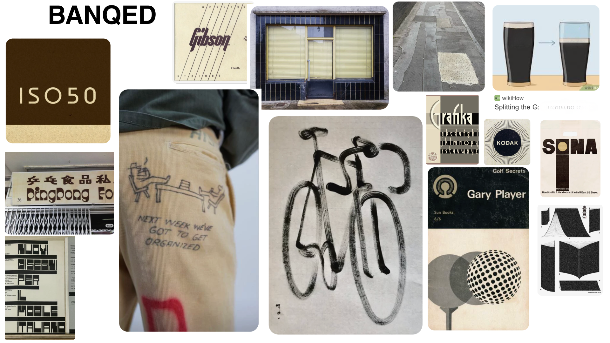

# BANQED

A personal wardrobe management web application built with Flask.

BANQED gives individuals the asset management infrastructure that businesses take for granted: a structured record of what they own, what it is worth, how often they use it, and a pipeline for reselling what they no longer need.

**Live application:** https://banqed-flask.onrender.com

---

## What the application does

**Wardrobe** is a full catalogue of every lodged item with its estimated resale value. Items can be searched, filtered by any combination of attributes (category, colour, brand, country, wear frequency and more), sorted, and edited inline.

**Sales** is a filtered view of items marked for resale. Each item moves here automatically when its resale willingness is set to "Sell now" or "Sell if price is right", and returns to the wardrobe if the decision changes. The sales pipeline tracks listing date, sale date, listing price, sold price and days to sell.

**Lodge an Item** is a multi-section form with searchable, dependent dropdowns. Category drives item type; country drives location. All dropdown options are seeded from the original spreadsheet version of the system and extended from the live database.

**Progress** shows live totals computed from the database: total value in banq, listed value, revenue to date, items lodged, items listed and items sold.

**Opening Your Banq** is a step-by-step guide to doing the wardrobe reset once and maintaining the system after.

---

## Design inspiration

The visual identity of BANQED is drawn from mid-century print and packaging
design. The colour palette is inspired by the colours in a pint of Guinness.



This inspiration is carried directly into the CSS:

- **Palette** — the whole site runs on a small set of CSS custom properties
  (`--paper`, `--ink`, `--cream`, `--border`) taken from the aged-paper-and-ink
  tones of the reference material.
- **Typography** — a Times-based serif for the newspaper front page, with
  uppercase letterspaced sans-serif labels everywhere else, echoing ledgers
  and vintage packaging.
- **Layout** — hairline rules and borders instead of boxes and drop shadows,
  the way a printed page divides itself.
- **The home page is a newspaper** you turn page by page, rather than a
  scrolling landing page.

The mood board is a collage of found reference images collected during the
design phase; all rights remain with their original owners of course!

---

## Technical overview

| Layer | Detail |
|---|---|
| Framework | Flask 3.1 |
| Database | SQLite via Flask-SQLAlchemy |
| ORM | Single Item model. Sales is a filtered view, not a separate table. |
| Templates | Jinja2 with a shared base.html layout |
| Styling | Vanilla CSS with custom properties |
| JavaScript | Two files: script.js (site-wide, newspaper navigation) and banq_table.js (wardrobe and sales tables) |
| Hosting | Render (free tier, gunicorn) |

### Flask features demonstrated

- Multiple routes with GET and POST methods
- render_template with data passed from SQLAlchemy queries
- A JSON API endpoint (POST /api/items/id) for inline editing without page reloads
- URL parameters (/wardrobe/lodge?added=1) for post-submit state
- Data structures: lists and dictionaries for dropdown seeds, a custom SQLAlchemy model with computed properties

### Python features demonstrated

- SQLAlchemy ORM with aggregate queries (func.sum, func.count)
- A one-off database migration script (migrate_merge_sales.py)
- A data import script from an Excel source (import_data.py)
- Computed model properties (days_to_sell, on_sales, is_sold)
- Helper functions for building seeded dropdown options merged with live database values

### JavaScript features demonstrated

- A click-through newspaper on the home page with keyboard and swipe support
- Client-side search, multi-field filter tokens with removable tags, value range filtering and sorting, all without page reloads
- Inline row editing via fetch() to the JSON endpoint with live chip re-rendering
- A shared searchable dropdown component (combobox pattern) used across the lodge form and table edit mode

---

## Running locally

```bash
git clone https://github.com/CatherineTomato/banqed-flask
cd banqed-flask
python3 -m venv venv
source venv/bin/activate
pip install -r requirements.txt
python3 app.py
```

Open http://127.0.0.1:5000 in your browser.

The SQLite database (instance/banqed.db) is included in the repository and contains the full wardrobe dataset imported from the original spreadsheet version of the system.

---

## Deploying to Render

1. Sign in at render.com and click New → Web Service.
2. Connect the GitHub repository (CatherineTomato/banqed-flask), branch `main`.
3. Set the build command: `pip install -r requirements.txt`
4. Set the start command: `gunicorn app:app`
5. Choose the free instance type and click Create Web Service.
6. Render installs dependencies, starts the app, and serves it at the
   generated URL. Pushes to `main` trigger automatic redeploys.

---

## Accessing the hosted application

**URL:** https://banqed-flask.onrender.com

The application is hosted on Render's free tier. Free instances spin down after periods of inactivity, so the first request after a period of inactivity may take 30 to 50 seconds to respond. Subsequent requests are fast.

All 117 items from the original wardrobe dataset are present in the live database.

---

## Project structure

```
banqed-flask/
├── app.py                       Flask application, routes and queries
├── models.py                    SQLAlchemy model (Item)
├── options.py                   Seed data for all dropdowns
├── requirements.txt
├── migrate_merge_sales.py       One-off migration, merged two-table schema into one
├── import_data.py               Imports data from BANQED.xlsx
├── data/
│   └── BANQED.xlsx              Source spreadsheet
├── instance/
│   └── banqed.db                SQLite database
├── templates/
│   ├── base.html                Shared layout (nav, CSS and JS links)
│   ├── index.html               Home page (newspaper)
│   ├── wardrobe.html            Wardrobe view
│   ├── sales.html               Sales pipeline
│   ├── lodge_item.html          Lodge an Item form
│   ├── progress.html            Live totals
│   └── opening_your_banq.html  Onboarding guide
└── static/
    ├── css/
    │   └── style.css            All styles
    ├── js/
    │   ├── script.js            Site-wide: newspaper navigation, nav marking
    │   └── banq_table.js        Wardrobe and sales tables, filter engine, editing
    └── images/
        └── banqed-logo.png
```